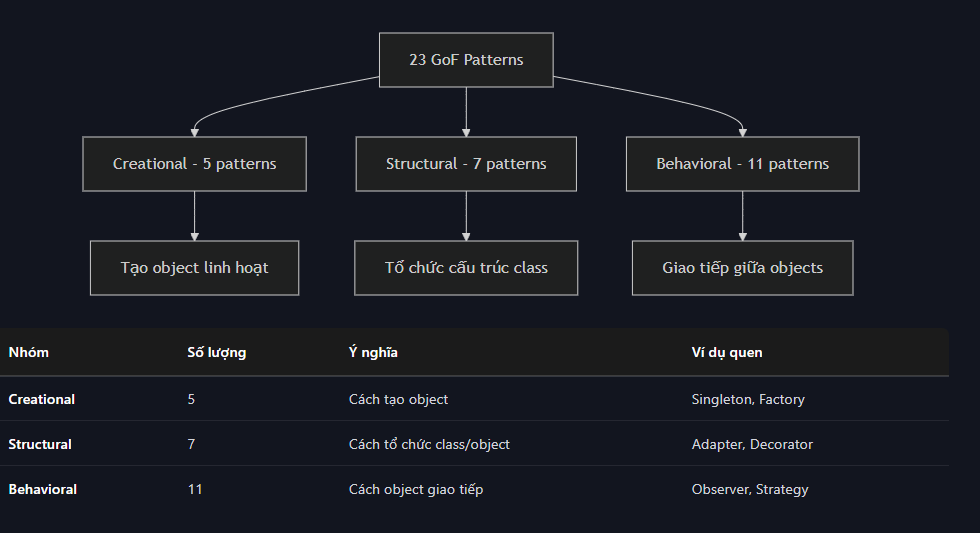
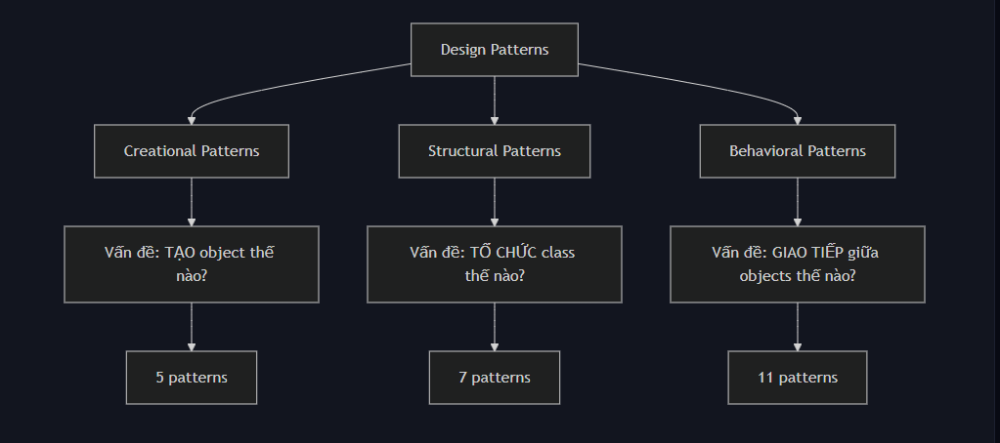
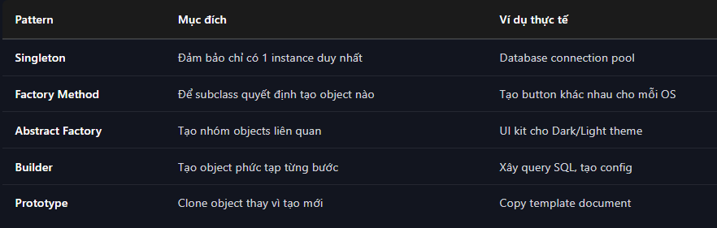
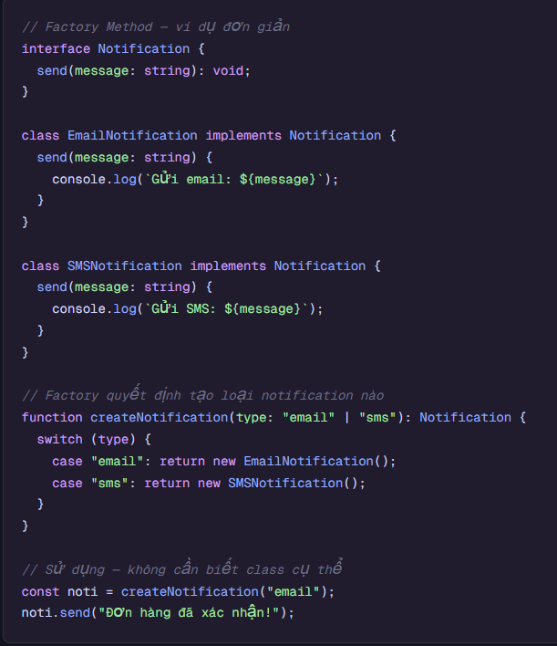
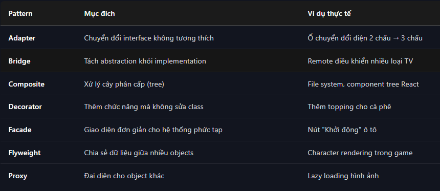
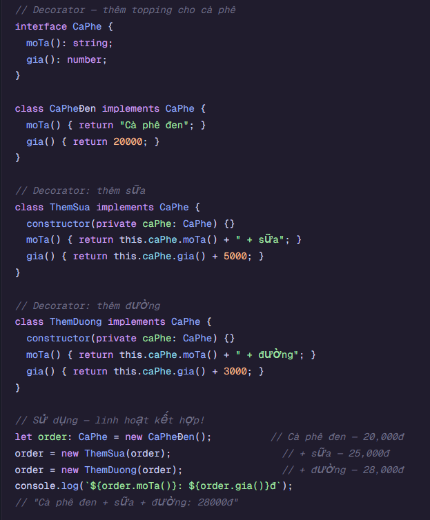
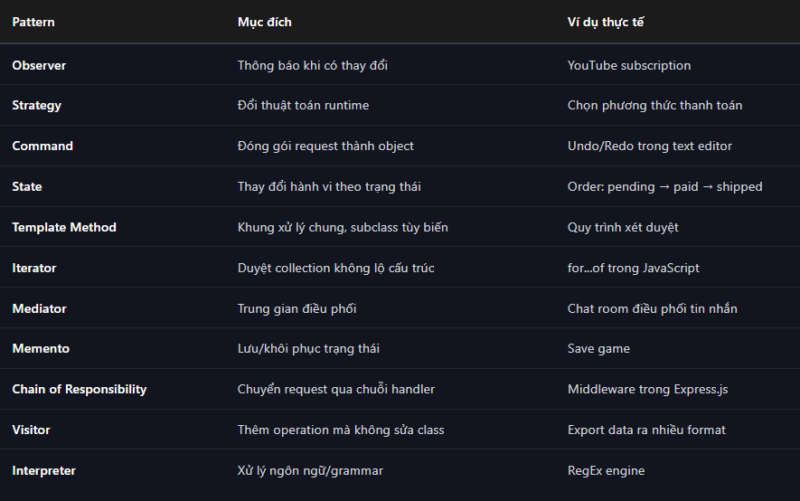
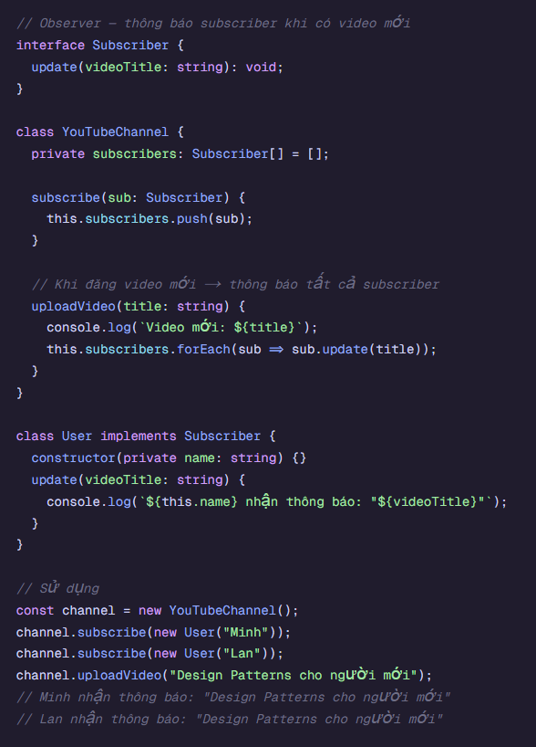
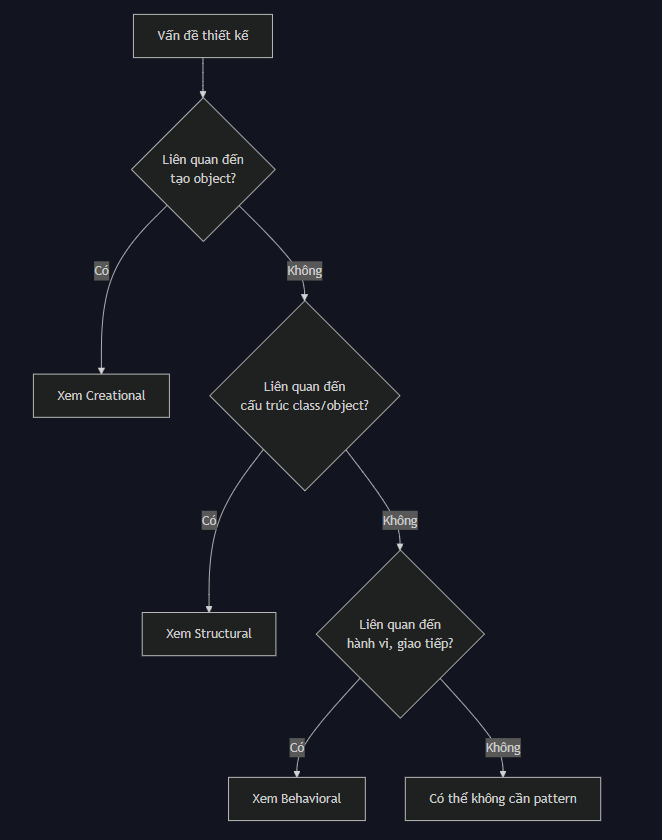
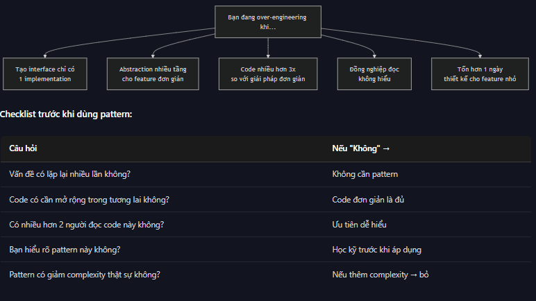

# Design pattern  
- Giải pháp đã chứng minh cho vấn đề thiết kế lặp lại  
- 23 patterns gốc chia làm 3 nhóm:  
  

- Hiện tại:  
    - React dùng Observer pattern (State management), Composite pattern (component tree)  
    - Angular dùng Dependency Injection (một dạng của Strategy + Factory)  
    - Node.js dùng Middleware pattern (Chain og Responsibility)  
- Tổng quan 3 nhóm pattern:  
    - Tạo bánh (creational): Dùng công thức nào? Máy nào nhào bột? Lò nào nướng?  
    - Tổ chức quầy (structural): Kệ bánh đặt ở đâu? Tủ nguyên liệu sắp xếp thế nào? Quầy thu ngân kết nối với bếp ra sao?  
    - Phục vụ khách (Behavioral): Ai nhận order? Ai làm bánh? Khi hết nguyên liệu thì thông báo ai?  
  

## Creational Patterns - nhóm khởi tạo (5 patterns)  
- **Giải quyết vấn đề**: Làm sao để tạo object một cách linh hoạt, không phụ thuộc cứng vào class cụ thể  
  

*VD factory*:   

## Structural Patterns - Nhóm cấu trúc (7 patterns)  
- **Giải quyết vấn đề**: Làm sao tổ chức class và object thành cấu trúc lớn hơn mà vẫn linh hoạt, dễ bảo trì  
  

*VD decorator*:   

## Behavioral Patterns - Nhóm hành vi (11 patterns)  
- **Vấn đề giải quyết**: Làm sao các object giao tiếp và phân chia trách nhiệm hiệu quả  
  

*VD observer*:   

- Flow chọn pattern:   

**Quy tắc tránh over-enginneer**: 
    - NẾu vấn đề giải quyết được bằng 1 function -> không cần pattern  
    - Prototype/MVP  
    - Code không thay đổi  
    - Team nhỏ, chỉ 1-2 người  
    - Không hiểu rõ pattern đang dùng  
  

